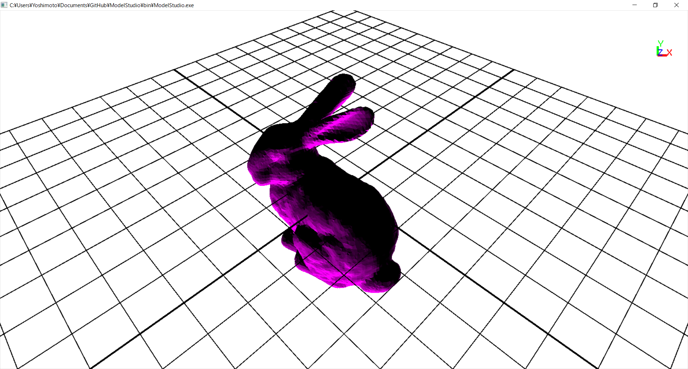

ModelStudio v0.0.0
====

## Overview

This project is for viewing, editing, and converting 3D models using OpenGL.

## Requirement

- LIB: glut, OpenGL
- PATH: anywhere (default: ../data)

## Format
- Supported 3D model format: obj, stl, vox(original)
- Supported Image format: bmp

## Smpale command

	-l:../data/sample2.obj
	-c:obj2vox:128
	-p:fill
	-s:2:../data/slice/img.slice

## Licence

[MIT](https://github.com/yoshimoto56/modelstudio/blob/master/LICENSE)

## Author

[yoshimoto56](https://github.com/yoshimoto56)